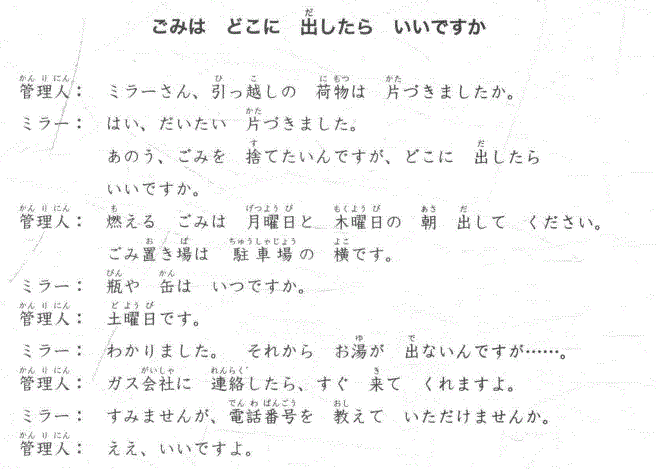
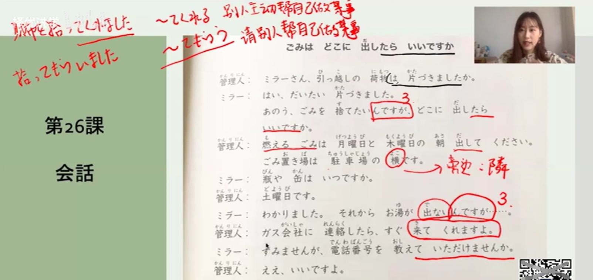

> 使用假名标注过于复杂，故下文中将不会采用 如 「<ruby>生<rp>(<rp><rt>い</rt><rp>)</rp></ruby>け<ruby>花<rp>(</rp><rt>はな</rt><rp>)</rp></ruby>」的标准写法以便提高效率 

> 接续体：原型，た形　ない形　ている形　なかった形
---
## # 26

#### 例句：
１．明日（あした）から、旅行（りょこう）なんです。
２．生け花（いけばな）を習（なら）いたいんですが、いい先生（せんせい）を紹介（しょうかい）していただけませんか？

**说明表现：「～んです」、「～のです」** 
前者更为口语，后者为书面语。

接续形式：动词，形容词，形容动词的接续体。名词+**な**のです（映画なんです。映画なのです）

用法：

1. **事情说明**
   
   明日から、旅行なんです　＝＞　解释说明
   明日から、旅行です＝＞  阐述客观事实
   从明天开始旅行。
   
   雨が降っている。＝＞　阐述客观事实（正在下雨）
   雨が降っているんだ。＝＞　解释说明（说明给其他人，【欸，在下雨呢】）
   
2. **理由说明**

   - *向对方询问理由*

   渡辺さんは時々　大阪弁をつかいますね。
   大阪に住んでいた**んですが**？
   ....ええ、15歳まで大阪に住んでいました。
   
   面白いデザインですね。どこで買ったんですか？
   ....エドヤストアで買いました。スペインの靴です。（在江户商店买的。是西班牙的鞋子）
   
   - *自己进行理由的说明*
   
   道が混んでいますね。（混む　混乱，拥挤）
   ....事故があったんでしょう。
   
   よくカラオケに行きますか？
   ....いいえ、あまりいきますん。カラオケは好きじゃないんです。
   
3. **婉转表达自己的主见**

   生け花を習いたいんです**が**、いい先生を紹介していただけませんか？(が作为小转折，婉转，后半句会接上请求或者意见等)
   「～んですか、～でいただけませんか？（请求对方帮忙做某事）／～たらいいですか？（接た形，对方寻求建议/办法）」
   
   
   
   日本語でレポートを書きたいんですが、ちょっと見ていただけませんか？（我想用日语写报告，能稍微帮我看一下吗？）
   
   
   
   国会議事堂（こっかいぎじどう）を見学（けんがく）したいんですが、どうしたらいいですか。
   
   ....直接行ったらいいですよ。平日はいつでも見ることができます。

#### 单词：

| 単語     | 假名     | 翻译                                  | 例句                               |
| -------- | -------- | ------------------------------------- | ---------------------------------- |
| 住む     | すむ     | 居住，住                              | あなたはどこに**住んでいますか**？ |
| 靴       | くつ     | 谢                                    | 靴を脱ぐ（ぬぐ）、靴を履く（はく） |
| スペイン |          | 西班牙（Spain）                       |                                    |
| 選ぶ     | えらぶ   | 选择                                  | ～を選ぶ                           |
| 見学     | けんがく | 参观学习                              | ～を見学する                       |
| 平日     | へいじつ | ①平时，平常 ② 休日，节假日以外的日子 |                                    |
|ゴミ|||ごみを出す、ごみをすてる、燃えるゴミ|
|置き場|おきば|防治物品的场地|ゴミ置き場、身の置き所（容身之处）|
|引っ越し|ひっこし|搬家||
|片付く／片付ける|かたづく／かたづける|收拾整齐，整顿 （自动词が，他动词を）||
|駐車場|ちゅうしゃじょう|停车场||
|瓶、缶|びん／かん|瓶，罐||
|お湯|おゆ|热水||

[出る]  でる

- （移動）家を出る
- （現れる）電車は6時に出る
- （参加·出席）会議に出る、オリンピックに出る

[出す]　だす

- （内から外へ）バッグから財布を出す
- （発する）窓から顔を出す、大声を出す
- （送る·提出）手紙を出す、書類を出す

**练习 单词**

| 单词/短语            | 解释       |
| -------------------- | ---------- |
| 会社を休む           | 向公司请假 |
| 会社をやめる         | 辞职       |
| エレベーターに乗る。 | 乘电梯     |
| 手伝う               | 帮忙       |
| 狭い                 | 狭窄       |
| 間に合う             | 来得及     |
| ダイエット           | 减肥       |
| 調べる               | 调查       |
| 拾う                 | 捡，拾     |

#### 会話:

**ごみはどこにだしたらいいですか**

管理人：ミラーさん、引っ越しの荷物は 片づきましたか。
ミラー：はい、だいたい片づきました。あのう、ごみを捨てたいんですが、どこに出したらいいですか。
管理人：燃えるごみは月曜日と木曜前の朝出してください。ゴミ置き場は 駐車場の横です。
ミラー：瓶や缶はいつですか。
管理人：土曜日です。
ミラー：わかりました。それから お湯が出ないんですが……。
管理人：ガス会社に 連絡したら、すぐ来て くれますよ。
てんわばんごう おし
ミラー：すみませんが、電話番号を教えていただけませんか。
管理人：ええ、いいですよ。

